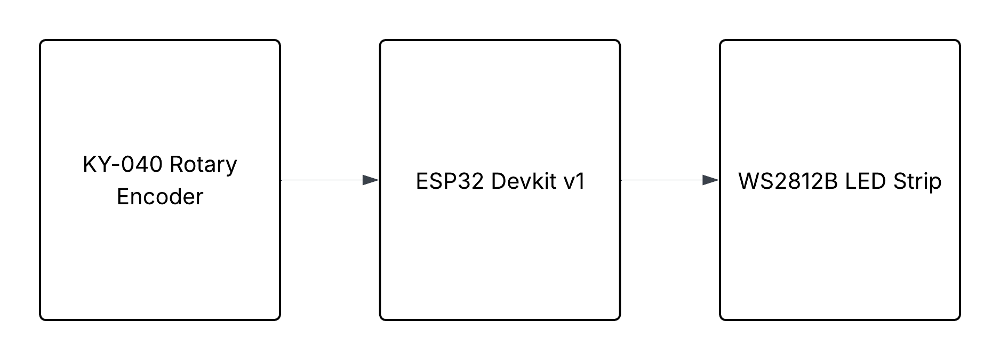

# 5780-Group-A Addressable LED controller
### Group name: 
**LED strips**

### Group Members:
**Ian Smith, Zachary Au**

### Project Description
This project uses an ESP32 Dev board to drive a WS2812B LED and uses a KY-040 rotary encoder to change the color of the WS2812B LED. It can be relatively easily expanded to drive multiple LED's but we ran out of time before the deadline. 

Our team took a *nearly* bare-metal approach by using any libraries or frameworks as minimally as possible and only interfacing directly with the relevant peripherals on the ESP32-WROOM-32 MCU. 

The peripherals we use are the RMT (Remote Controller Peripheral) and the PCNT (Pulse Count Controller). Please see the [Technical Reference Manual](https://www.espressif.com/sites/default/files/documentation/esp32_technical_reference_manual_en.pdf) for more information on those peripherals and how to use them. 

The RMT peripheral is used to output the necessary bits to the WS2812B LED's as they require relatively fast and irregular pulses to communicate with. This peripheral alone drove our decision to choose the ESP32 board since outputting on the order of a couple 100 nano-seconds consecutively was an edge case for our STM32 boards used in class and would likely not be able to handle that timing as consistently as we needed. 

The PCNT peripheral is used to read the values from the encoder and determine the position and direction when turned. We then use a PCNT interrupt to fire when the rotary encoder is turned one "detent" to change the color/state of our LED's. 

Our implementation of 3 labs is:
- Interrupts
- GPIO
- Serial Communication Protocols (The WS2812B's use their own custom protocol).

### Parts:

- 1x [WS2812B RGB Strip from BFT-LIGHTING](https://www.amazon.com/BTF-LIGHTING-Individual-Addressable-300Pixels-Non-Waterproof/dp/B088BRY2SH?dib=eyJ2IjoiMSJ9.UlD2wY2OyCdb8HeV4kGvRNANJW4NY0eJQhS5p0hD8mqzZjsL0Eef_I2zDBk87Ma2xvyYDo2QLknx2CcO6o_q9KGhMVUSgOn4zaRKeQqH0zGb4I1loJVnk9N_CJf846OMTAO4w7QIiG3EnuqOsc1ofQ02XE5ZZGmgRWA9l0Zzwuyp3cwAWWO20hxYXmNrTmd89lj2sqwfPrTAICX94hqhrHLLA2yVAGBq_oUKakpNAOLbqZhLZDla6LZqqBn3rIDuUskYFVT7VmIMLzNu2tdg81cCBnfcrQHAG6eZSnvKPMg.GmmRW8YEthTt1vAApS8HN4G1lS5KJdHeA2I9mDJGKZk&dib_tag=se&hvadid=598927104191&hvdev=c&hvlocphy=9029755&hvnetw=g&hvqmt=e&hvrand=15967142953267108302&hvtargid=kwd-28908797123&hydadcr=29866_14609794&keywords=addressable%2Bled%2Bstrip&mcid=b1356eb6f3c73ec2bb32246fa60391cd&qid=1742508449&sr=8-5-spons&sp_csd=d2lkZ2V0TmFtZT1zcF9hdGY&th=1) 
  - any strip that uses WS2812B led's will do
- 1x [KY-040 Rotary Encoder Module](https://www.amazon.com/dp/B0D2TW63G1?smid=AFROYR18L3YC4&ref_=chk_typ_imgToDp&th=1)
- 1x [ESP32-WROOM-32](https://www.amazon.com/ESP-WROOM-32-Development-Microcontroller-Integrated-Compatible/dp/B08D5ZD528?crid=2MBIOUJ9C89KF&dib=eyJ2IjoiMSJ9.XBINg-sjhfF_gUtnMiKGjo6krKzkTp-dHnP9KceEUJUTtbzXztsRVRgxdvtu4o650FtVYbMtrjrrDUZVrlYraJ1oB3s3rQRdfh5yy_EYH5ljRrC6Nxt9OhivwYW3GINt7gwgvX4RE7_3XIxO67MoX1FKN8t5_s_FURnsIJsQbZa5HqK4YKkMHABHHqtDHgxvh6Zq0G3treRQBbmKch3PcsGX0D9iPKCk2t6ucpYhv_U87hU_NgnJ6C_WI5itR878clsnKDX6YhiLt7szORnSzxo4vt5wH_cKOZHQDo61OGw.O4l8AquG-xLN8-K-RWsZJ_DLEwzTe5peferUslZzbW4&dib_tag=se&keywords=esp32&qid=1745551712&s=electronics&sprefix=esp32%2Celectronics%2C167&sr=1-1&th=1)     
  - version of ESP32 board does matter so make sure you get this one or one nearly identical as the gpio pins need to match
- 1x [5V power-supply](https://www.amazon.com/BTF-LIGHTING-AC100-240V-Transformer-Converter-5-5x2-1mm/dp/B089GWVT61?crid=3F0X0J3E0N31M&dib=eyJ2IjoiMSJ9.efvLFSYFx7FaRTE8r0BB89dW0fjgaaaEiXJPifLy2JDdfqq3FFd6snh7ZNbgqrQyuz2E0VisgeTXlgr2eKar7_vIquUXRxFuklmhVjoW5p4.I7qXuNFjejVIVrqj5WqjfbzAynX02ue-6lgG7RzVb84&dib_tag=se&keywords=bft-lighting+power+supply&qid=1745551930&s=electronics&sprefix=bft-lighting+power+suppl%2Celectronics%2C125&sr=1-2-catcorr) capable of driving number of LED's you will be using. 
  - We use this power supply to also drive the ESP32 so there is no need to connect the ESP32 through Mini-usb power. My code only drives 1 LED but this can be expanded to drive multiple. Please see [WS2812B datasheet](https://cdn-shop.adafruit.com/datasheets/WS2812B.pdf) to get your exact wattage required but we found that 1 WS2812B LED can use up to ~50mA of current and uses on average ~20mA of current. Note the ESP32 we use can output a max of 40mA of current so a single LED could fry your ESP32 if you set each RGB value to max (#FFF / max power usage).
- 1x [100 uF capacitor](https://www.amazon.com/Tnisesm-Electrolytic-Capacitor-Aluminum-Radial/dp/B0CZ71WTV2?crid=312B74AL3LYU4&dib=eyJ2IjoiMSJ9.wUWZ1dB7QX9i61fiKl5C4s3QZSHdKbqxz-zhZ53EgolnXHsGSkRjlGmX406T1aQfCFKjKVRCpUC5uGum42pUP5upeGnLnLC6RhWQhUqJ-tndhHZU4dS0lGxEmANSiaMUMDcbqUpIc3SZP4nTKwbt2w_oXNUGiw7R7I0-AJahxSqwtLorI2ozXgIowlizQFK3f6fjcA4rbC56uIri0yXTwYDIiSb8n9MOjr7qjKae2oE.zlv8jjBR9ijluJLS1Q-RWCSihOlj8W43_yN2DJ-uJAg&dib_tag=se&keywords=100+uf+capacitor&qid=1745552516&sprefix=100+uf+capacitor%2Caps%2C141&sr=8-3)
  - Used to reduce noise on data line to WS2812B LED (not including this means you will likely end up with LED's changing colors or not being set properly. This issue did arise in our development).
- 1x [~100-500 Ohm resistor](https://www.amazon.com/EDGELEC-Resistor-Tolerance-Multiple-Resistance/dp/B07QK9ZBVZ?crid=2YJV1IBM2ZHDO&dib=eyJ2IjoiMSJ9.P096KrUwAQaYpFbd1lSySWZr4BXPVZTrw8m9mfCL1hVIw27gJm91yjlvrlKJ9PngXO0ls--6gWbOqdsbx5dCXDPG0uTDTDY0wrpSfEDFq4znmrt74AtICWplJ_nEURSaXr9JV8HkstwCogwW6byfYxb-hqEuA4lxng3ku2ABOP4BJcFUkUVo70eXU4hNMG81muroAiYV2VVAtW7l9nJisqAbHKcccxW56oYFGqHenDs.Ax2h1MqCLM7HuLHRdS2rCb1LbPpCSCDzXqa-S5BnIGw&dib_tag=se&keywords=220%2Bohm%2Bresistor&qid=1745552677&sprefix=220%2Bohm%2B%2Caps%2C168&sr=8-3&th=1)
  - Used in series with data line to ESP32 input pin to reduce noise. (we used 220 Ohm)
- (Optional) [Protoboard](https://www.amazon.com/ELEGOO-Prototype-Soldering-Compatible-Arduino/dp/B072Z7Y19F?crid=2MOL3T7AINQWZ&dib=eyJ2IjoiMSJ9.aAkey0GxSdsBlIR3vNq8qlUmzW9sm4MCGnrgRnKpyngp6ugLVfOI3c0SEZcVof519n1kH3K9XkZLJe0vOF1vOOC1hWQkA5GxAc0GK5V-UdZtc7DdlaJ_B_KHG_h9yEzG354CsK_mByibP99nViSaBvsRB3HgWfoncIsjhk2AF57uPwe8bCgnB_fyAC45Q2MiFQEv4Kb6HpSScxq4TA5G4TceCQMkxyEq0WuHPrjhudU.VZ8Hp2RxA_jNBQUB1_MBOAEbcyol28G4BBOvR1aSxIw&dib_tag=se&keywords=protoboard&qid=1745552750&sprefix=protoboard%2Caps%2C172&sr=8-3) or breadboard to solder/connect components to. (We a single protoboard piece from the linked kit)
- [Wires for connection](https://www.amazon.com/EDGELEC-Breadboard-Optional-Assorted-Multicolored/dp/B07GD2BWPY?crid=2YWOI5X5JF4WI&dib=eyJ2IjoiMSJ9.gwHgNDEvbJIijdj4kC86ZQxUKa8ev4yOq-Hz6sCjaDfpprklzSXQLxUl8dyCGYvjLeXbtBSEQ2Kh5egQwccnZ-GCgoObz04YqYXwEyv0Kr---JlBck2p5n9_-vhK368y5Y2lIhePGajXg2Ucr2ASB4w8Jw_rIP5CfhN4rYHVbkaXs51GkNDhTnMvVRujTEOgm-E3tAhgglYzGQkqVVizNIUVqTFOeHimMPsaonxiGTc.O0v8FTKh9Cuv0-0VQ6TnF5zZYN7iwESq9-x3grQuA3o&dib_tag=se&keywords=protoboard+wire+kit&qid=1745552847&sprefix=protoboard+wire+ki%2Caps%2C145&sr=8-3) (we already had some but a good kit is linked)

### Setup: 
This project will not work after pulling down as platformio forces us to choose a framework for the project and the framework files are installed locally. **You will instead have to setup your own ESP-IDF project** for the Espressif Dev Module board in platformio and copy our [main.c](src/main.c) and [encoder.c](src/encoder.c) files to your projects src folder. Then also copy our [encoder.h](include/encoder.h) file to your projects *include* folder

### Diagrams:

#### Block Diagram

#### Wiring Diagram

### Final Product
[Video Demo](https://youtube.com/shorts/bqnqiADCuRU?feature=share)

